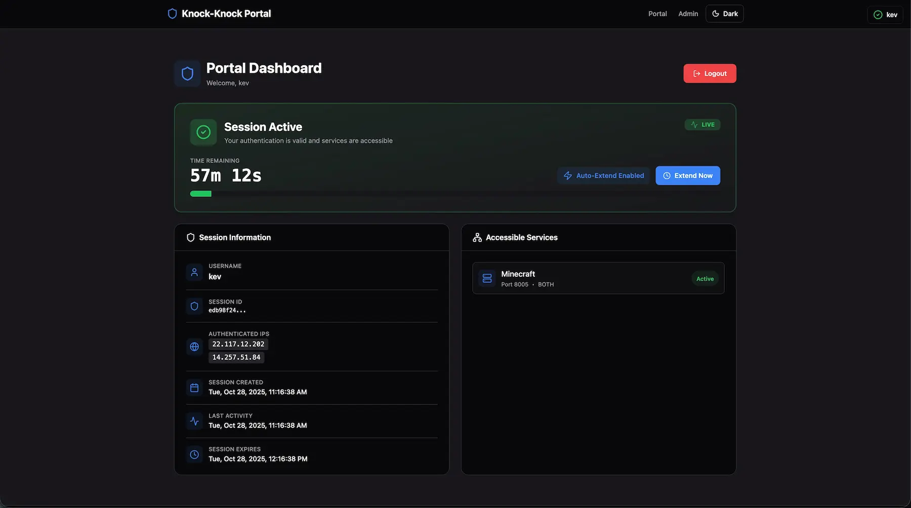
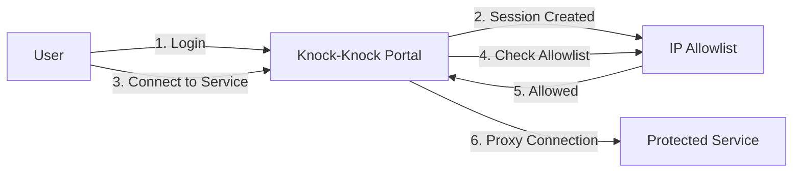

# 🔐 Knock-Knock Portal

**A secure authentication gateway that protects your self-hosted services with session-based access control.**

Stop worrying about exposing services to the internet. Users authenticate once, and **everyone on their network** gets temporary access automatically. Services stay protected behind intelligent IP filtering.



> ⚠️ **Important Security Note**: Access is granted based on your public IP address. This means **all users sharing the same public IP** (e.g., people on the same home/office network, or behind the same NAT) will have access to the authorized services during an active session. **This is by design** - the portal is built to grant network-wide access, not device-specific access.

---

## 🎯 What Is This?

Knock-Knock Portal is a lightweight authentication gateway that sits in front of your services (databases, admin panels, APIs, etc.) and controls who can access them. Instead of managing complex firewall rules or VPNs, users simply log in through a web portal and get temporary access.

**Perfect for:**
- 🏠 Homelab enthusiasts protecting self-hosted services
- 🏢 Small teams needing simple service access control
- 🔧 Developers securing staging/test environments
- 🌐 Anyone exposing services to the internet safely

---

## ✨ Key Features

### 🔐 Flexible Access Control
- **Session-based authentication** - Users log in and get time-limited access (configurable duration)
- **Multi-IP session support** - Automatically handles users switching networks (mobile/WiFi/VPN)
- **Permanent IP allowlists** - Whitelist trusted IPs/ranges that always have access
- **Dynamic DNS support** - Allow access from dynamic IPs using DNS hostnames
- **Per-service permissions** - Control which users can access which services

### 🎛️ Web-Based Management
- **Admin Dashboard** - Manage all sessions, view connections, configure services
- **User Portal** - Clean interface for users to authenticate and monitor their access
- **Real-time monitoring** - See active sessions and live connections
- **Session controls** - Auto-extend sessions, manual session extension, instant revocation

### 🔄 Smart Proxying
- **TCP/UDP proxy support** - Works with any network protocol
- **Port range mapping** - Proxy multiple ports per service
- **Zero downtime config reload** - Update services without restarting
- **Connection tracking** - Monitor active connections in real-time

### 🛡️ Security First
- **JWT-based authentication** - Secure token-based sessions
- **Bcrypt password hashing** - Industry-standard password protection
- **Rate limiting** - Built-in protection against brute force attacks
- **Security headers** - CSP, CORS, and modern security best practices
- **IP blocklist** - Permanently block malicious IPs

### 🐳 Easy Deployment
- **Docker ready** - One command to deploy
- **Pre-built images** - AMD64 and ARM64 support
- **YAML configuration** - Human-readable config files
- **Environment variables** - Easy secret management
- **Health checks** - Built-in monitoring endpoints

---

## 🚀 Quick Start

### Docker Deployment

Use the included [`docker-compose.yml`](docker-compose.yml):

```bash
docker-compose up -d
```

**That's it!** 🎉

Access the portal at `http://localhost:8000`

**Default password:** `admin123` ⚠️ **Change this immediately in production!**

---

## 📖 How It Works

### Architecture Overview



### Flow Diagram

```
┌─────────────┐          ┌──────────────────────┐          ┌──────────────┐
│    User     │          │  Knock-Knock Portal  │          │   Service    │
│  (Browser)  │          │                      │          │  (Database)  │
└──────┬──────┘          └──────────┬───────────┘          └──────┬───────┘
       │                            │                             │
       │  1. POST /api/portal/login │                             │
       ├───────────────────────────>│                             │
       │                            │                             │
       │  2. JWT Token + Session    │                             │
       │<───────────────────────────┤                             │
       │                            │                             │
       │                            │ 3. Add IP to Allowlist      │
       │                            ├────────────┐                │
       │                            │            │                │
       │                            │<───────────┘                │
       │                            │                             │
       │  4. Connect                              │               │
       ├─────────────────────────────────────────>│               │
       │                            │                             │
       │                            │ 5. Check IP in Allowlist    │
       │                            ├────────────┐                │
       │                            │            │                │
       │                            │<───────────┘                │
       │                            │                             │
       │                            │ 6. Proxy to Upstream        │
       │                            ├────────────────────────────>│
       │                            │                             │
       │                            │ 7. Return Data              │
       │                            │<────────────────────────────┤
       │                            │                             │
       │  8. Data                   │                             │
       │<─────────────────────────────────────────┤               │
       │                            │                             │
```

### Technical Flow

1. **Authentication Phase**
   - User submits credentials via web portal
   - Backend validates against bcrypt hash
   - JWT token generated and returned
   - User's IP added to session allowlist

2. **Access Control Phase**
   - User attempts to connect to proxied service
   - Portal checks IP against allowlist (session, permanent ranges, DNS)
   - If allowed, connection is proxied to upstream service
   - If denied, connection is rejected

3. **Session Management**
   - Sessions have configurable duration
   - Auto-extend on activity (optional)
   - Multi-IP support for roaming users
   - Manual session termination available

4. **Proxy Layer**
   - TCP/UDP transparent proxy
   - Port mapping (external → internal)
   - Real-time connection tracking
   - Zero-copy data transfer

### Access Methods

The portal supports multiple authentication methods:

| Method | Description | Use Case |
|--------|-------------|----------|
| 🔑 **Authenticated Session** | User logs in via web portal | Remote workers, dynamic IPs |
| 📌 **Permanent IP Range** | Static allowlist of IP ranges | Office networks, home IPs |
| 🌐 **Dynamic DNS** | DNS hostname resolution | Dynamic home IPs with DDNS |
| 👤 **Per-User Permissions** | Service-level access control | Team members with different roles |

---

## ⚙️ Configuration

All configuration is done through the web-based admin panel. You can configure services, users, IP allowlists, and more directly from the UI.

**💡 Pro Tip:** No YAML editing required - everything is managed through the intuitive web interface!

---

## 🐳 Docker Deployment

### Pre-Built Images

Images are automatically built for AMD64 and ARM64:

```bash
# AMD64 (Intel/AMD)
docker pull ghcr.io/davbauer/knock-knock-portal:main-amd64

# ARM64 (Apple Silicon, Raspberry Pi)
docker pull ghcr.io/davbauer/knock-knock-portal:main-arm64
```

### Docker Compose

See [`docker-compose.yml`](docker-compose.yml) for the complete configuration.

For production, update the docker-compose.yml with your own secure credentials.

---

## 🔒 Production Setup

### Generate Secure Credentials

```bash
# Admin password hash (bcrypt)
htpasswd -bnBC 12 "" your-strong-password | tr -d ':\n'

# JWT secret (32 bytes base64)
openssl rand -base64 32
```

Update these values in your `docker-compose.yml` environment variables, then deploy:

```bash
docker-compose up -d
```

---

## 📊 Admin Dashboard Features

- **👥 User Management** - View all active sessions, see connected IPs
- **🔌 Connection Monitoring** - Real-time view of all active connections
- **⚙️ Service Configuration** - Add/edit/remove services on the fly
- **🚫 Session Control** - Terminate sessions instantly
- **📈 Access Statistics** - Monitor usage and connection patterns
- **🔄 Config Reload** - Update configuration without downtime

---

## 🛠️ Development

Want to contribute or run locally?

```bash
# Frontend (Svelte 5 + TypeScript)
cd frontend
yarn install
yarn dev

# Backend (Go 1.24+)
cd backend
go mod download
go run cmd/server/main.go
```

### Tech Stack

**Frontend:**
- Svelte 5 (with runes)
- SvelteKit
- TypeScript
- TailwindCSS
- Ark UI

**Backend:**
- Go 1.24+
- Gin (HTTP framework)
- JWT authentication
- Bcrypt password hashing
- YAML configuration

---

## 📝 License

This project is licensed under a **Proprietary License with Limited Grant**. See the [LICENSE](LICENSE) file for details.

For commercial licensing inquiries, contact [@davbauer](https://github.com/davbauer).

---

## 🤝 Support

- 🐛 **Issues**: [GitHub Issues](https://github.com/davbauer/knock-knock-portal/issues)
- 💬 **Discussions**: [GitHub Discussions](https://github.com/davbauer/knock-knock-portal/discussions)

---

**Made with ❤️ by [David Bauer](https://github.com/davbauer)**
